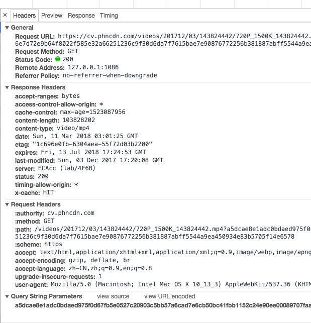
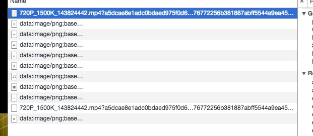
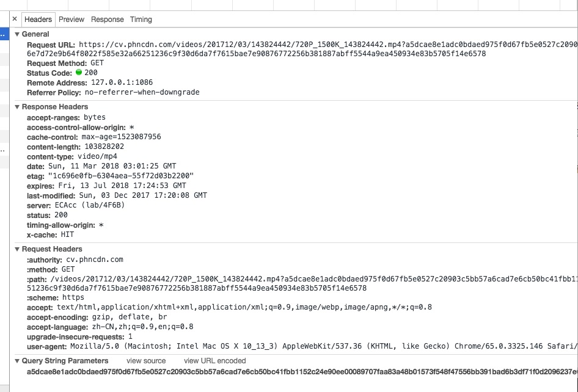
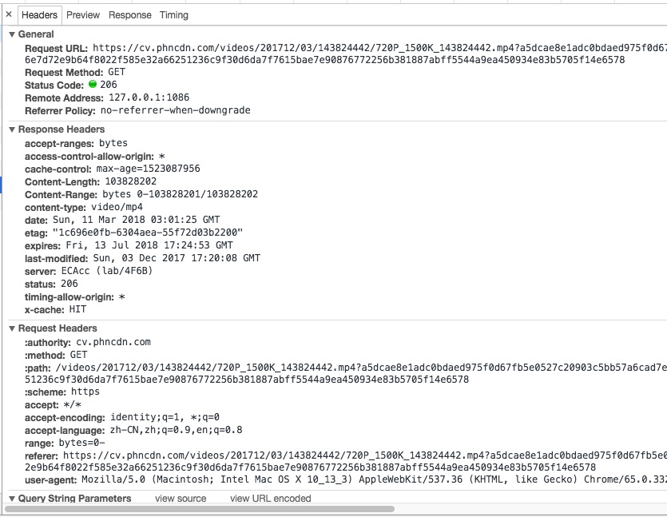
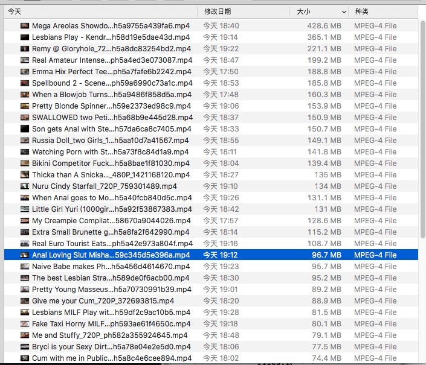

## 遇到的问题

我去年写了一个爬虫 [ 传送门 ](https://github.com/blackmatch/pornhub-downloader)，这个爬虫主要是爬某国外网站，获取下载链接，然后根据下载链接下载对应的视频文件到本地。爬的内容有点不可描述，主要还是为了练手吧（学技术学技术。嗯嗯）。放在 github 一段时间后，竟然被一个朋友关注到这个爬虫，然后他悄悄地爬视频，某一天他找到我说我的爬虫问题：**下载的视频很多是不完整的，比如某个文件下载45%就停止了，不管重新下载多少次都是差不多到45%就停止了**。这样每次看视频的时候，只能看到前面一点，把进度条拖动到后面视频就停止播放了，这很影响用户体验啊！！！（咳咳）

## 排查原因

下载的时候我使用了 [request](https://github.com/request/request) 模块，我一开始以为是请求参数的问题，然后去 `github`、 google 查了好久，尝试了在请求头中加 `Connection: keep-alive`、`gzip: true` 都不行，折腾了两天未果，暂时扔一边。原来答应朋友要更新版本也没更新。。。

过完年回来，每天会打开 `github`，然后看看当天的 [trending](https://github.com/trending)，偶尔看到有人给我这个爬虫 star。感觉还是挺欣慰，于是乎想把这个 **严重影响用户体验** 的问题修一修，没有啦，只是想弄清楚是怎么回事（学技术学技术）。

然后开始鼓捣，先爬取某个视频的下载链接，然后把这个链接扔到 `chrome`，打开开发者模式看网络请求，请求头大致如下：



根据 `请求头` 和 `响应头`，我没看出有什么端倪，感觉会不会是请求超时了，但是我监听了 `error` 方法，没有触发。然后又是一顿 google，然后怀疑服务器端是不是 `allowHalfOpen` 问题，经过打印 `socket` 实例，排除了这个可能，再次陷入僵局。折腾了一番后我有点想放弃使用 `request` 了，而是拥抱 [puppeteer](https://github.com/GoogleChrome/puppeteer)，因为 `puppeteer` 毕竟是基于 `Chromium` 的，因为我已经确认爬到的下载链接通过浏览器是可以下载的。但是 `puppeteer` 目前还没有下载功能，所以问题又回到了原点。

中午吃完饭，番剧都看完了。又想起了这个 **严重影响用户体验** 的问题，于是爬一个下载链接，扔 `chrome` 开发者模式，不断刷新观察网络情况。刷新了几次，我貌似发现了一些猫腻，先上一张图：



老铁们看出猫腻了没？可能刚看完番剧心情比较好，我发现在浏览器打开下载链接的时候，同一个下载链接请求了两次。（注：在浏览器直接打开下载链接，会直接在浏览器播放视频）直觉告诉我问题肯定出在这两次请求上，于是分析这两次请求，第一个请求如下：



第二个请求如下：



对比两次请求：

* 第一次请求的 `Status Code` 是 `200`，第二次请求的 `Status Code` 是 `206`。
* 第二次请求的响应头里多了一个 `Content-Range` 属性。

又是直觉告诉我这个 `Content-Range` 有古怪，于是去查找相关资料。官方的解释是：

```js
The Content-Range response HTTP header indicates where in a full body message a partial message belongs.
```

大致的意思是：`Content-Range` 在响应头中表明本次请求的内容只是一个完整的 `body` 的一个部分。也就是说，一个完整的文件被分成了多个部分返回给客户端，所以客户端需要通过多次请求才能完整的接收整个文件。这下问题就清晰了。

## 解决问题

经过上面的分析，我知道了：我的爬虫程序只进行了上述的第一次请求，得到的 `Status Code` 是 `200`，而且响应头中并没有 `Content-Range` 属性。我一开始想的是，我的爬虫干脆也先后发起两次请求，在第二次请求中获取 `Content-Range` 属性进行下一步操作。后来想想这样太麻烦了，应该还有更简单的方法。于是就琢磨了这个方法：**发起一次请求，拿到文件的总大小（响应头中的`Content-Length`），然后根据文件的大小判断要不要分段下载**。经过简单的测试，当文件大小超过 50M 的时候，服务器返回的时候就会分段返回，因为我的爬虫默认下载最高质量的文件，一般是 720P（心中无码，自然高清），所以下载的文件很多都是不完整的。

最终敲定方法：如果文件大于 20M，就分段下载，否则就直接下载。分段下载是多个文件，等所有文件下载完后，再把这些文件拼接成一个完整的文件，最后把分段下载的文件删掉即可。

于是乎开始改造爬虫，核心代码如下：

```js
const maxChunkLen = 20 * 1024 * 1024; // 20M

if (ctLength > maxChunkLen) {
          log.info('the file is big, need to split to pieces...');
          const rgs = [];
          const num = parseInt(ctLength / maxChunkLen);
          const mod = parseInt(ctLength % maxChunkLen);
          for (let i = 0; i < num; i++) {
            const rg = {
              start: i === 0 ? i : i * maxChunkLen + 1,
              end: (i + 1) * maxChunkLen
            };
            rgs.push(rg);
          }

          if (mod > 0) {
            const rg = {
              start: num * maxChunkLen + 1,
              end: ctLength
            };
            rgs.push(rg);
          }

          const pms = [];
          const files = [];
          rgs.forEach((item, idx) => {
            const copyOpts = _.cloneDeep(opts);
            copyOpts.headers['Range'] = `bytes=${item.start}-${item.end}`;
            copyOpts.headers['Connection'] = 'keep-alive';

            const file = path.join(dir, `${ditem.key}${idx}`);
            files.push(file);
            const pm = new Promise((resolve, reject) => {
              request.get(copyOpts)
                .on('error', err => {
                  reject(err);
                })
                .pipe(fse.createWriteStream(file, { encoding: 'binary' }))
                .on('close', () => {
                  resolve(`file${idx} has been downloaded!`);
                });
            });
            pms.push(pm);
          });

          log.info('now, download pieces...');
          return Promise.all(pms).then(arr => {
            // concat files
            log.info('now, concat pieces...');
            const ws = fse.createWriteStream(dst, { flag: 'a' });
            files.forEach(file => {
              const bf = fse.readFileSync(file);
              ws.write(bf);
            });
            ws.end();

            // delete temp files
            log.info('now, delete pieces...');
            files.forEach(file => {
              fse.unlinkSync(file);
            });

            return resolve(`${dst} has been downloaded!`);
          }).catch(err => {
            return reject(err);
          });
        }
```

经过改造后，文件都能下载完整了。看视频的时候就可随意拖动进度条了（学技术学技术，嗯嗯）：



## 后记

这个问题断断续续困扰了我好几天，最后还是把这个 **严重影响用户体验** 的问题解决了。走了不少弯路，查了一些关于 http 的东西，也算是有点收获。最重要的是了解了分段下载这个场景，以及 `Content-Range` 的用法。需要注意以下几点：

* 请求时，在请求头中添加 `Range` 属性来设置分段下载的文件大小范围，值的格式为：`bytes=start-end`。
* 文件大小范围 `start` 要从 `0` 开始，不能从 `1` 开始，否则拼接后的文件无法打开。
* 分段下载时，每一个下载的子进程获取的文件大小范围不要有交叉也不能忽略某部分，必须是连续的。

## 参考资料

[https://emacsist.github.io/2015/12/29/Http-%E5%8D%8F%E8%AE%AE%E4%B8%AD%E7%9A%84Range%E8%AF%B7%E6%B1%82%E5%A4%B4%E4%BE%8B%E5%AD%90/](https://emacsist.github.io/2015/12/29/Http-%E5%8D%8F%E8%AE%AE%E4%B8%AD%E7%9A%84Range%E8%AF%B7%E6%B1%82%E5%A4%B4%E4%BE%8B%E5%AD%90/)

[https://developer.mozilla.org/en-US/docs/Web/HTTP/Headers/Content-Range](https://developer.mozilla.org/en-US/docs/Web/HTTP/Headers/Content-Range)