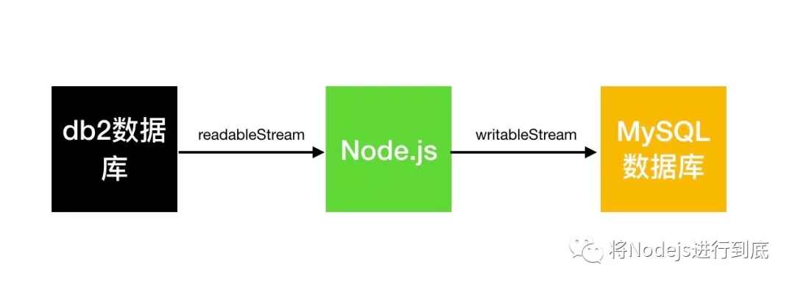
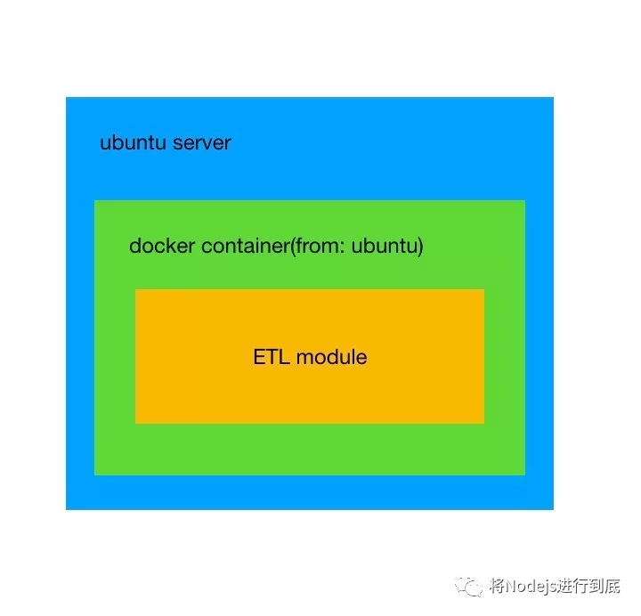

IBM DB2 是美国 IBM 公司开发的一套关系型数据库管理系统，它主要的运行环境为 UNIX（包括 IBM 自家的 AIX）、 Linux、 IBM i（旧称 OS/400 ）、 z/OS，以及 Windows 服务器版本。 DB2 主要应用于大型应用系统，具有较好的可伸缩性，可支持从大型机到单用户环境，应用于所有常见的服务器操作系统平台下。

我需要实现的技术方案如下：



需要从 db2 数据库中取数，然后把数据写入到 MySQL 数据中。

## 理论知识

DB2 数据库几个概念

instance, 同一台机器上可以安装多个 DB2 instance。

database, 同一个 instance 下面可以创建有多个 database。

schema, 同一个 database 下面可以配置多个 schema。 所有的数据库对象包括 table、 view、 sequence， etc 都必须属于某一个 schema。

另外， database 是一个 connection 的目标对象，也就是说用户发起一个 DB2 连接时，指的是连接到到一个 database，而不是连接到一个 instance，也不是连接到一个 schema。

但是 DB2 的启动和关停是以 instance 为单位的。可以启动一个 instance，或者关停一个 instance。但不可以启动或者关停一个数据库或者一个 schema。

## 使用的模块

使用了 ibm_db，该模块在安装时会根据当前平台自动下载对应的客户端驱动程序。

第一坑
遇到的第一坑是 CODEPAGE（代码页），可以简单的理解为这是数据库的编码，在 db2 数据库数据库中，如果客户端和服务端的 CODEPAGE 不一致，连接时会报错：

```plaintext
SQL0332N  Character conversion from the source code page "1386" to the target code page "819" is not supported
```

而使用的 ibm-db 中没有提到如何设置 CODEPAGE 的方式，在各种 google 攻略后，得到的解决方案有两个：

* 修改客户端的操作系统语言。

* 添加系统环境变量 `DB2CODEPAGE`。

我的后端架构为：



最外层是 ubuntu 系统，然后起一个容器，容器是基于 ubuntu16.04 的，然后在容器中有一个 ETL 模块，这是一个 node 模块， node 通过调用这个模块去连接 db2 数据库。

不论我怎么修改最外层的 ubuntun 系统还是容器中的 unbuntu 系统的语言和环境变量，都不起作用。

最终解决方案：

在 `ETL module` 模块中，在连接 db2 代码之前设置环境变量：

```plaintext
process.env.DB2CODEPAGE = 1386;
```

## 第二坑

成功连接到 db2 数据库后，发现取到的数据的中文是乱码。于是又开始在网上找攻略，大多数答案都是说 `CODEPAGE` 问题。可是上一个坑已经解决了呀。优于无法直接访问到 db2 所在的服务器，所以无法很准确的确认 db2 数据库使用的 `CODEPAGE` 值，但是经过各种调试及执行如下 SQL 语句：

```plaintext
SELECT CODEPAGE FROM SYSCAT.DATATYPES WHERE TYPENAME = 'VARCHAR';
```

得出的结论都是： db2 数据库的 `CODEPAGE` 是 1386 ，可以理解成 db2 数据库的编码是 GBK。所以我把客户端的 CODEPAGE 设置成 1386 应该是没有问题的呀？但是实际情况就是中文无法正确展示。

最终解决方案：

```plaintext
process.env.DB2CODEPAGE = 1208;
```

将客户端的 CODEPAGE 设置成 1208 即可。一脸懵逼啊！此方案是我拍脑袋尝试后得出的。 1208 对应的编码是 utf8 。

## 其他坑

* 环境问题，项目自身的打包发布流程存在各种坑。

* ibm_db 问题， 2.1.0 之前的版本在连接上是存在一些问题的，我开始折腾的时候是 2.3.0 版本，其实这个版本也有一些问题，然后我提了个 issue，过了两天后更新到了 2.3.1 ，使用这个版本后神奇的解决了连接问题。

* 使用 ibm_db 去连接 db2 数据库，不是真正的命令行客户端连接，而是使用了一个驱动程序去连接，所以网上的在客户端执行 `db2set DB2CODEPAGE=1386` 的方法都行不通。

* 使用 Node.js 连接 db2 数据库的相关资料较少，使用的人也少，搜到很多都是 java 的资料。

## 总结

为了实现开头提到的技术方案，我加班加点花了差不多一个礼拜的时间，除了项目本身的打包、运行环境的坑以及对 db2 不熟悉外，其他问题大概花了两天左右。经过一个礼拜的折腾，对解决问题有了一些心得：

* 环境很重要，因为我在本地开发环境是执行代码是比较顺利的，但是现场环境比较复杂，所以在解决问题之前要充分了解现场的软件环境，包括操作系统、版本等。

* 如果是没遇到的东西，最后先去了解基本的概念、必要的基础知识。

* 从最终代码执行处入手，如果我一开始就在使用代码连接 db2 的地方通过 `process.env.DB2CODEPAGE` 打印出来的话，可能会省很多时间。

## 参考资料

[https://www.jianshu.com/p/e1f38505f789](https://www.jianshu.com/p/e1f38505f789)
