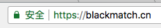

[letsencrypt](https://letsencrypt.org/) 提供了免费的 SSL 证书服务，我们可以用它来实现 HTTPS。我的服务器系统是 CentOS7 ，使用的 server 程序是 [nginx](https://nginx.org/en/)。下面分享我使用 letsencrypt 的过程。官方推荐使用 [certbot](https://certbot.eff.org/) 工具。

* 开启 CentOS 的 EPEL 扩展

```shell
wget https://dl.fedoraproject.org/pub/epel/epel-release-latest-7.noarch.rpm
```

```shell
yum install -y epel-release-latest-7.noarch.rpm
```

* 安装 certbot

```shell
yum install -y certbot-nginx
```

* 停止 nginx 服务

```shell
systemctl stop nginx
```

* 生成 SSL 证书

```shell
certbot certonly --standalone -d blackmatch.cn -d www.blackmatch.cn
```
中途需要输入邮箱、同意协议等，按照提示操作即可。

> 把域名替换成你自己的域名。

* 配置 nginx 文件，编辑 `/etc/nginx/conf.d/default.conf`，参考我的配置：

```
server {
    listen 80;
    server_name blackmatch.cn www.blackmatch.cn;
    return 301 https://$server_name$request_uri;
}

server {
    listen 443 ssl;
    server_name blackmatch.cn www.blackmatch.cn;

    ssl_certificate /etc/letsencrypt/live/blackmatch.cn/fullchain.pem;
    ssl_certificate_key /etc/letsencrypt/live/blackmatch.cn/privkey.pem;
    ssl_session_cache shared:le_nginx_SSL:1m;
    ssl_session_timeout 1440m;

    ssl_protocols TLSv1 TLSv1.1 TLSv1.2;
    ssl_prefer_server_ciphers on;

    ssl_ciphers "ECDHE-ECDSA-CHACHA20-POLY1305:ECDHE-RSA-CHACHA20-POLY1305:ECDHE-ECDSA-AES128-GCM-SHA256:ECDHE-RSA-AES128-GCM-SHA256:ECDHE-ECDSA-AES256-GCM-SHA384:ECDHE-RSA-AES256-GCM-SHA384:DHE-RSA-AES128-GCM-SHA256:DHE-RSA-AES256-GCM-SHA384:ECDHE-ECDSA-AES128-SHA256:ECDHE-RSA-AES128-SHA256:ECDHE-ECDSA-AES128-SHA:ECDHE-RSA-AES256-SHA384:ECDHE-RSA-AES128-SHA:ECDHE-ECDSA-AES256-SHA384:ECDHE-ECDSA-AES256-SHA:ECDHE-RSA-AES256-SHA:DHE-RSA-AES128-SHA256:DHE-RSA-AES128-SHA:DHE-RSA-AES256-SHA256:DHE-RSA-AES256-SHA:ECDHE-ECDSA-DES-CBC3-SHA:ECDHE-RSA-DES-CBC3-SHA:EDH-RSA-DES-CBC3-SHA:AES128-GCM-SHA256:AES256-GCM-SHA384:AES128-SHA256:AES256-SHA256:AES128-SHA:AES256-SHA:DES-CBC3-SHA:!DSS";

    root   /usr/share/nginx/html;
    index  index.html index.htm;
    error_page  404              /404.html;
}
```

保存退出文件

* 启动 nginx

```shell
systemctl start nginx
```

* 测试

在浏览器访问 [blackmatch.cn](https://blackmatch.cn/)，如果配置成功应该像这样的：



如果失败，请根据错误提示寻找合适的解决方案。

* 定期更新证书

证书的默认有效期是 3 个月，所以每三个月要更新一次证书。可以通过 Linux 的 `crontab` 来定期更新证书，使用 `crontab -e` 命令打开编辑界面，最后添加一行：

```shell
0 0 1 * * certbot renew
```

然后保存并退出。这样就设置了每个月 1 号的 0 点 0 分自动刷新证书。