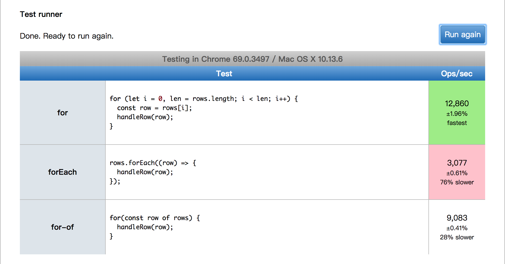

## 前言

今天测试 MM 给我提了个 issue：某个页面点击查询后就卡死了。由于查询的数据量比较多，我第一反应就是相关接口的 SQL 语句需要优化，但是我调试的时候发现几条查询语句都在 500 毫秒内得到结果返回了，而且这几条查询是并发执行的，所以 SQL 语句没问题，经过调试发现，主要耗时在程序的循环遍历，最外层的循环有 250 多次，每次遍历需要消耗 500 毫秒左右，这样的话接口返回就需要 2 分钟左右，而前端请求接口的超时默认是 80 秒，超时后走 `catch` 回调，估计前端也没有处理 `catch` ，所以导致界面一直转圈圈卡死了。言归正传，接口的主要耗时是在程序的循环操作，因为循环中有嵌套，总共 3 层（代码写得好烂，但是基于现在的业务逻辑，也只能这样了），通过 `debug` ，发现最耗时的操作在最里层的循环中。

## 分析问题

在第 2 层的循环，有一个操作是：**从一个数组中找出符合条件的所有元素，取这些元素的值进行一些计算**，使用的方式也是循环遍历。我们把这个元素称为 `arrayData`，这个数组的长度为 15000 左右，遍历这个数组的操作便是第 3 层循环。第 1 层循环次数是 250 次左右，第二层循环次数是 4 次，第 3 层循环次数是 15000 次左右。第 3 层循环在第 2 层循环中会执行多次，代码结构是这样的：

```js
 for () {
    // 第 1 层循环
    for (){
      // 第 2 层循环

      arrayData.forEach((item) => {
        // 第 3 层循环
      });

      arrayData.forEach((item) => {
        // 第 3 层循环
      });
      ...
    }
  }
```

感觉有点不忍直视。。。自己写的代码，哭着也要调试完。第 3 层循环，完整的走完一遍，大概需要 80 毫秒左右，然后在第 2 层循环中有 4 次这样的循环，所以这部分操作就消耗了 320 毫秒左右。所以，我把注意力集中在如何优化这 320 毫秒上。

## 优化方案

### 从业务逻辑优化

我首先考虑的是从业务逻辑上进行优化，经过排查代码，发现一个可行的方法是：减少 arrayData 的长度。`arrayData` 可以从业务逻辑上进行分组，得到几个长度大约 **2000** 左右的数据，这样第三层循环的时候就大大减少了循环次数，原来是 **15000\*4=60000** 次，现在是 **2000\*4=8000** 次，减少了 **52000** 次。经过这样优化，第 3 层循环每次大概需要 40 毫秒左右，原来的耗时是 80 毫秒，这样对最外层的循环来说，每次减少了 40\*4=160 毫秒，总时间减少了 **250\*160 = 40000**  毫秒，也就是 40 秒！我滴乖乖！虽然总时间减少了 40 秒，但还是很慢。

### 从数组遍历方式上优化

从上面的代码结构中可以看到，第 3 层循环使用的是 `forEach` 来进行遍历的，第 1 层和第 2 层其实使用的是 `ES6的 for-of` 进行遍历的。这个差别让我产生了疑虑：这两种遍历方式会不会存在性能上的差异？于是，我把第 3 层的遍历方式从 `forEach` 换成了最古老的 `for 循环遍历`，代码是这样的：

```js
for (let i = 0, len = arrayData.length; i < len; i++) {
    const item = arrayData[i];
}
```

> 需要注意一个细节，在数组长度不会动态变化的情况下，要用一个变量来接数组的长度，不要直接写 `i<arrayData.length`，据说也会对性能有细微的影响。

这样一改，奇迹出现了。总时间又减少了 **20** 秒左右。然后再东补补西补补，接口总耗时 30 秒左右，对我们的系统来说已经是可以接受的程度了，然后代码提交发布，打完收工，测试 MM 对我刮目相看。哈哈哈。。。等等，还没完呢！请继续往下看。

## JavaScript 中的数组

JavaScript 的数组与其他编程语言的数组有较大的差别，首先， JavaScript 的数组元素可以是任意类型，一个数组，第 1 个元素可以是数字，第 2 个元素可以是字符串，第 3 个元素可以是对象；其次， JavaScript 的数组其实也是对象，有对象就有 **键** 和 **值**，默认情况下， JavaScript 会给数组每一个元素创建一个从 0 开始的键，可以通过 [key] 访问数组中的元素，如果 key 传的是整型，会自动转换成字符串类型。举例：

```javascript
const arr1 = [1, 'str', { name: 'blackmatch' }];
console.log(arr1[1]);           // str
console.log(arr1['1']);         // str
console.log(arr1.length);       // 3
console.log(Object.keys(arr1)); // [ '0', '1', '2' ]

const arr2 = ['str1', 'str2', 'str3'];
console.log(arr2[1]);           // str2
console.log(arr2['1']);         // str2
console.log(arr1.length);       // 3
console.log(Object.keys(arr2)); // [ '0', '1', '2' ]

const arr3 = [];
arr3['name'] = 'blackmatch';
arr3['age'] = 18;
console.log(arr3);              // [ name: 'blackmatch', age: 18 ]
console.log(arr3['age']);       // 18
console.log(arr3.age);          // 18
console.log(arr3.length);       // 0
console.log(Object.keys(arr3)); // [ 'name', 'age' ]

const arr4 = [];
console.log(arr4.length);   // 0
arr4['0'] = 1;
console.log(arr4.length);   // 1
console.log(arr4);          // [ 1 ]

const obj = {
  name: 'blackmatch',
  age: 18
};
console.log(obj.length);        // undefined
console.log(Object.keys(obj));  // [ 'name', 'age' ]
```

这里比较有意思的是，`arr3.length` 输出的结果是 0 。其实原因很简单：因为 `arr3` 中没有元素。通过 `arr3['age']=18` 的方式并不能给 `arr3` 添加元素，其原因是：

> 在 **ECMAScript** 中，**Object** 是所有对象的基础，因此所有对象都具有 **Object** 的基本属性和方法。

也就是说，  `arr3['age']=18` 只是给 `arr3` 添加了一个名为 `age` 的 **键**，并将其 **值** 设置为 `18` ，并没有往 `arr3` 中添加元素，而 `arr3.length` 返回的是 `arr3` 元素的个数。给数组添加元素可以通过 **对象字面量**、**push**、**unshift** 等方法实现，也可以通过 `arr[key]=value` 的形式来添加或者修改元素，需要注意的是这里的 `key` 必须是字符串的数字，比如： `arr['1']='element'` ，由于数组的最大长度是 (2 ^ 32) - 1 ，所以数组元素的 `key` 的范围是 0 ~ (2 ^ 32) - 2 。 JavaScript 的 `Array` 对象还有很多细节值得关注，这里就不一一展开了。

## JavaScript 中数组的遍历方式

JavaScript 数据遍历主要有以下 3 种方式：

* 最古老的 for 循环遍历

```javascript
for (let i = 0, len = rows.length; i < len; i++) {
  const row = rows[i];
}
```

* forEach 遍历

```javascript
row.forEach((row, idx, arr) => {

});
```

* ES6 的 for-of 遍历

```javascript
for (const row of rows) {

}
```

这 3 种遍历方式各有千秋，具体该使用哪种方式需要结合具体的业务场景，但是这 3 种遍历方式在性能上是存在差异的，我在 **jsPerf** 平台对这 3 种方式进行了性能比较。测试方式很简单：先准备一个长度为 20000 的数组，数组的每个元素是一个对象，然后分别使用这 3 种方式对数组进行遍历，对每个元素做一个简单的赋值操作，最后比较每种方式的耗时。准备代码如下：

```html
<script>
var rows = [];

for (let i = 0; i < 20000; i++) {
  const row = {
    name: 'blackmatch',
    age: 18
  };

  rows.push(row);
}

function handleRow(row) {
  if (row && row.age > 0) {
    row.age = row.age * 2;
  }
}

</script>
```

测试结果如下：



可以看出，在性能方面：**for>for-of>forEach**。测试地址为：[https://jsperf.com/for-vs-foreach-vs-for-of-by-blackmatch/1](https://jsperf.com/for-vs-foreach-vs-for-of-by-blackmatch/1) 。所以，如果需要遍历的数组长度比较大的时候，需要考虑一下性能问题。另外，不推荐使用 **for-in** 对数组进行遍历，具体原因就不赘述了。

## 后话

大家可能觉得一个接口要耗时几十秒，这能忍？说实话，我也不能忍，我的优化方式可能也不对；但是从结果来看，从原来的一直卡死，到现在的几十秒能出结果，至少这个功能现在能用了。还有最关键的一点就是，我们的客户甚至我的领导，对性能真的一点都不在乎，能用就行了，他们更在乎的是增加需求，修改需求，领导也不希望我在性能调优上花太多时间，其实我做的这次优化更多的是从业务逻辑上优化了，因为我一开始就觉得代码逻辑以及计算等操作不会消耗太多时间，应该优化的是 SQL 语句和数据库结构，但事实上，性能优化涉及到每一个细节，只是在不同的环境下某些细节会更加突出，某些细节可以忽略不计。不说了，我要去改需求了。。。

## 参考资料

《 JavaScript 高级程序设计（第 3 版）》

[https://zhuanlan.zhihu.com/p/23812134](https://zhuanlan.zhihu.com/p/23812134)

[https://juejin.im/post/5a3a59e7518825698e72376b](https://juejin.im/post/5a3a59e7518825698e72376b)
