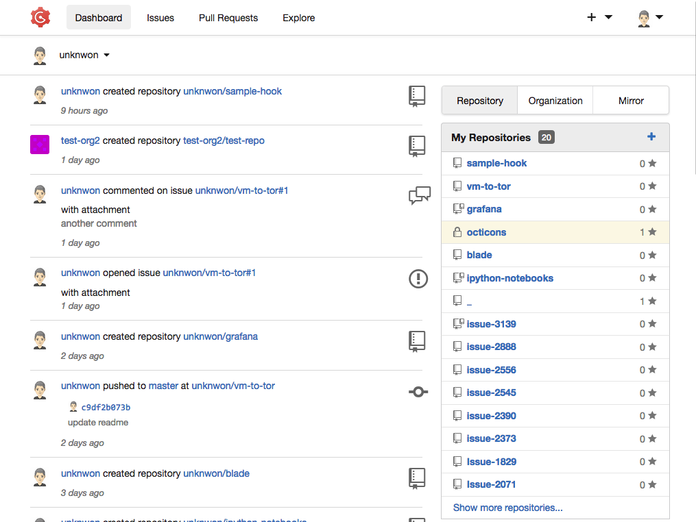
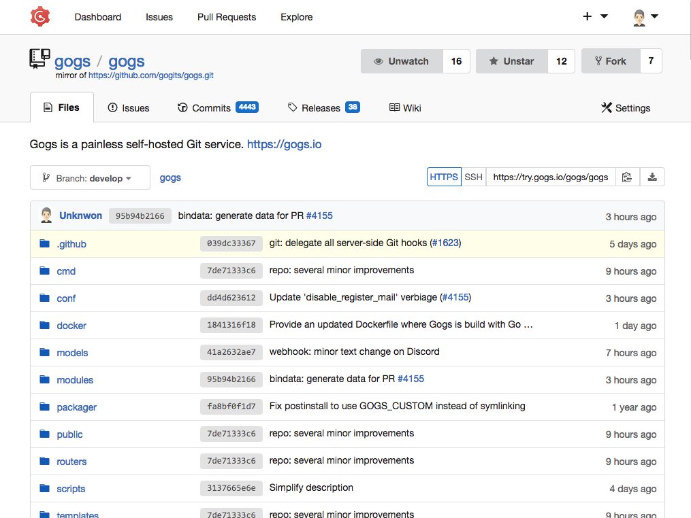
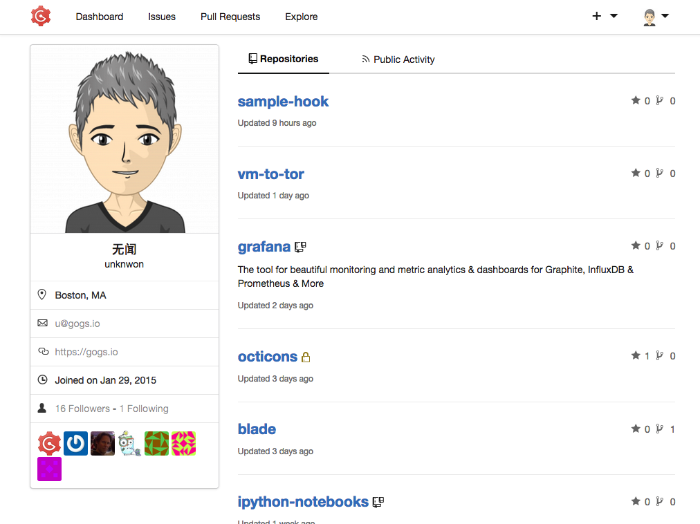

## 什么是 Gogs

Gogs 是一款极易搭建的自助 Git 服务。作为程序员，可能对 Github 已经非常熟悉了，我们经常会把自己的代码提交到 Github。非付费用户在 Github 的代码是公开的，任何人都可以看到你提交的代码。有时候我们不想让别人看到自己提交的代码，或者只是想让我们授权的人访问自己的代码，通常会有一下几种方式：

* 成为付费用户（不限平台），创建私有仓库。
* 选择拥有一定数量免费私有仓库的平台，比如： Bitbucket 等。
* 自己搭建完全免费的 Git 服务，比如： Gitlab 等。

Gogs 属于最后一种方式，这是一个开源项目，核心代码使用 Go 语言编写， UI 使用的是 Semantic-UI。Gogs 的目标是打造一个最简单、最快速和最轻松的方式搭建自助 Git 服务。 Go 目前支持 29 种语言，简体中文是必须的。

## Gogs 的使用场景

Gogs 适合中小团队使用，工作流和大部分的 Git 服务类似，可以创建组织、仓库和工单（ issue），也可以把其他平台的仓库迁移过来。总的来说， Gog 能满足中小团队大部分的 Git 工作流需求。

## 为什么推荐 Gogs

其实现在已经有很多类似的产品了，而且也都是免费的，有些甚至不用自己搭建，打开网页就能用，比如： Gitlab、码云等。我推荐 Gogs 只要是因为：

* 完全开源，遵循 MIT 协议。
* 核心代码使用 Go 语言编写（个人喜好）。
* 官方完美支持中文。
* 极易搭建。
* 极简风格。

## 如何搭建

官方提供了 5 种搭建方式，分别是：

* 二进制安装
* 源码安装
* 包管理安装
* 采用 Docker 部署
* 通过 Vagrant 安装

Gogs 需要将一部分数据保存到数据库中，所以需要数据库支持，可以使用以下几种数据库：

* MySQL：版本 >= 5.7
* PostgreSQL
* MSSQL
* TiDB（实验性支持，使用 MySQL 协议连接）
* 或者 什么都不安装 直接使用 SQLite3

根据官方文档的安装步骤一步一步搭建即可。但是，偷懒是程序员的必备技能之一啊！其实，搭建就分两部分： Gogs 主程序和数据库。 Gogs 主程序官方提供了 Docker 镜像，数据库也能找到对应的 Docker 镜像，于是自然而然就能想到 Docker 三剑客之一的 Docker Compose。大家可以使用我写的一个 docker-compose.yml 文件（数据库使用的是 MySQL），地址是：[https://github.com/blackmatch/gogs-docker-compose](https://github.com/blackmatch/gogs-docker-compose)，几分钟就能轻松搭建好。

## 一些截图

从官网搬来几张截图供大家欣赏：

## 更多信息

官网：[https://gogs.io/](https://gogs.io/)

官方体验网站：[https://try.gogs.io/](https://try.gogs.io/)
