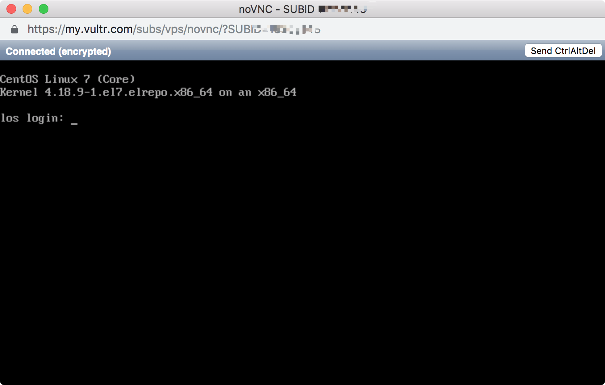
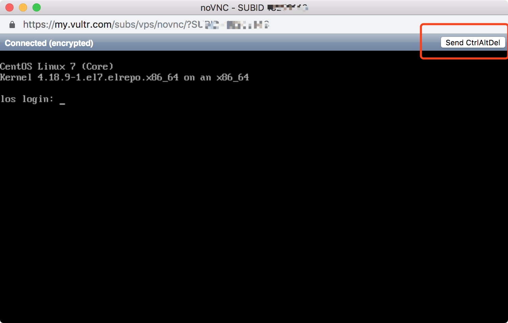
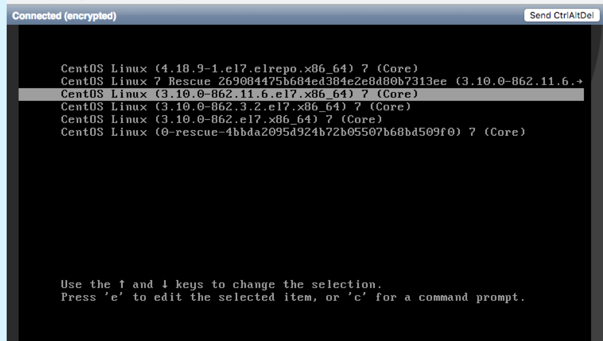
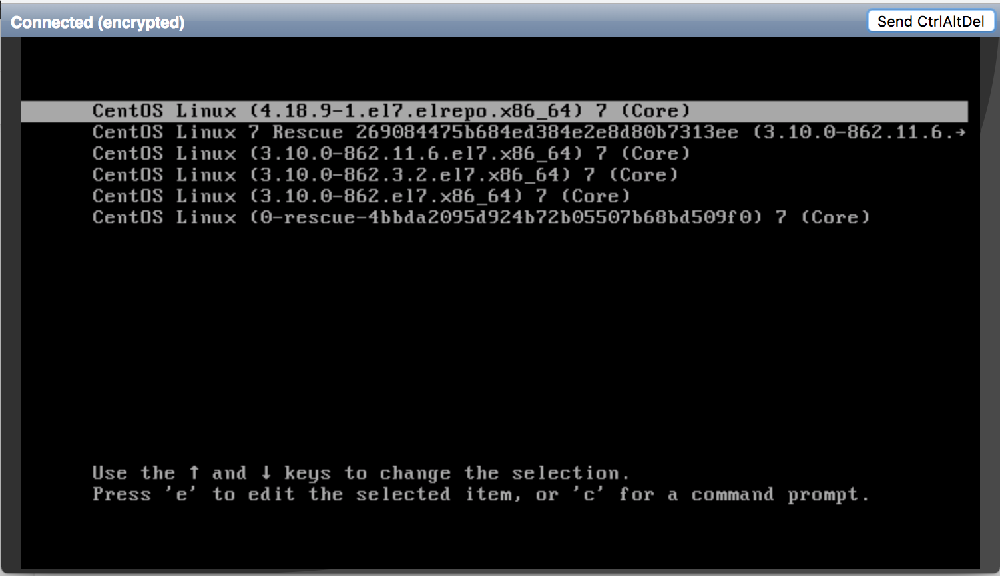
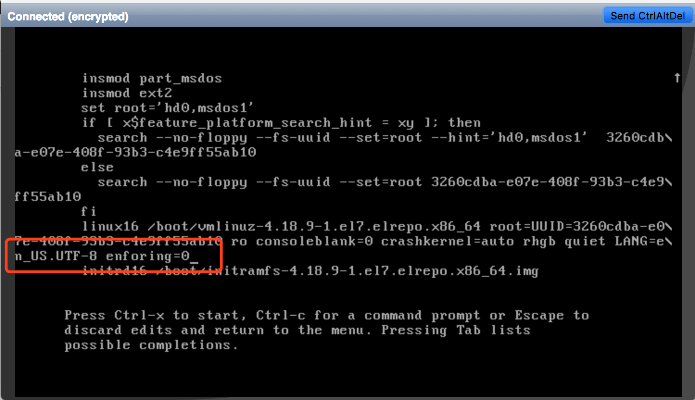

## 故事背景

我在 vultr 上有一台 VPS，由于服务器在洛杉矶，在国内访问速度比较慢。以前有听说 Google 的 bbr 拥塞算法能够提高 tcp 的传输速度，于是想着把 bbr 打开。我的服务器环境如下：

* 操作系统： CentOS7
* Linux 内核版本： 3.10.0
* SELINUX 配置： disabled
* docker 版本： 18.06.1-ce

## 开启 bbr

开启 bbr 需要先把 Linux 内核版本升级到 4.10 以上，所以首先需要升级内核。我是根据这个教程 [https://www.vultr.com/docs/how-to-deploy-google-bbr-on-centos-7](https://www.vultr.com/docs/how-to-deploy-google-bbr-on-centos-7) 一步一步操作的，最后将 Linux 内核版本升级到了 4.18.9 ，最后也成功开启了 bbr，感觉访问速度稍微开了那么一点点。

## docker 服务无法启动了

开启 bbr 后发现 docker 服务起不来了，尝试过几次删掉重装，结果还是一样，排查得到如下报错：

```plain
unable to configure the Docker daemon with file /etc/docker/daemon.json
```

把这个报错仍 Google，尝试了几个方案都不行。继续折腾，再根据报错信息：

```plain
failed to start docker application
```

继续 Google，在 segmentfault 找到了这个问答：[https://segmentfault.com/q/1010000002392472](https://segmentfault.com/q/1010000002392472)，感觉和我的情况很像啊。暗喜中。。。看到这个问题有好多人回答，我就从上往下一个一个试，其中有个回答是：


那我就照做 :

```plain
vim /etc/selinux/config
i
edit...
wq
shutdown -r now
```

一顿操作猛如虎，然后喝口茶等待系统重启。。。等了一两分钟，使用 ssh 连接服务，突然给我来一个惊喜：

```plain
permission denied
```

## 系统无法登录了

ssh 连不过去了，卧槽这是什么情况。因为我的服务器只有 `root` 账号，我一直都是用 `root` 账号登录的，想尝试其他账号也不行了。我意识到肯定是我刚才修改了 `SELINUX` 配置导致，但是现在登不进去系统想改回来也不行啊。虽然我对 Linux 懂的不多，但是这个时候一定要保持冷静，继续喝一口茶。想到了找学弟帮忙，学弟是做运维的，对 Linux 特别熟，大学时候和他一起培训过几天 Linux。学弟提醒我可以去 VPS 提供商的后台管理界面看看能不能做些什么。于是我登录到 vultr，进入后台管理界面，发现有一个 `View Console` 操作，如下：


点击，弹出一个窗口，进入了一个 Linux 终端：



哈哈！感觉看到了希望，输入账号、密码，用力敲一下回车键，啪！提示：

```plain
permission denied
```

什么鬼？？？结果还是一样啊！还是登不进去啊！冷静冷静。。。继续喝口茶， Google 一番尝试了一些方法，都不行。茶已经喝完啦，脾气也上来了。想着直接把系统重置了吧，反正也没有特别重要的数据。说时迟那时快，当我快要点击重置系统按钮的时候，脑子里突然闪过一个画面，就像动漫主角快要被干掉时突然开挂了一样，这个画面就是：



这个难道就是传说中的恢复模式？不管了，点一下看看，出现了这个界面：



卧槽！我感觉还能抢救一下。看个这个，感觉又看到了希望，外挂已上线 ~~ 哈哈哈。说实话，我对这个界面真的不熟，只知道这里有很多个内核，可以选择任何一个系统启动。于是问学弟，结果被学弟鄙视，让我我按照忘记密码的套路去操作，接下来又是一波搜索。经过一番倒腾，终于找到了一个可行的方案，具体操作如下：



选中一个内核，我这里选择的是我更新后的内核，按下键盘上的 `e` 键进入编辑模式，然后使用 `向下键` 一直往后翻，找到 `rhgb quiet LANG=en_US.UTF-8` 在后面加上 `enforcing=0` ，如下：



然后按下 `Ctrl` + `x` 启动系统，正确输入账号、密码，再次用力敲一下回车键，这次终于等进去了！！！总算是抢救回来了，然后里面修改 `SELINUX` 配置，又是一顿操作猛如虎，重启之后能正常登录了，彻底好了。

## docker 服务怎么办

虽然已经能够正常登录服务器了，但是 docker 还是老样子起不来。但是，在系统无法登录那一刻，我冥冥之中已经感觉到 docker 的问题应该如何解决了，因为我看到了这个回答：


我的直觉向来很准的，因为读大学的时候自己经常折腾各种黑科技之类的，这种感觉我很熟悉，哈哈哈。按照这个方法操作，**最后 docker 服务真的好了**，哈哈哈！

## 结束语

本来都已经打算重置系统了，没想到最后 bbr 成开启了， docker 服务也弄好，真是成功逆袭了啊！因为我对 Linux 不是很熟，所以大牛们可能觉得这根本不算是什么事，对我来说那可是相当惊险刺激啊！感谢学弟的耐心指导，我以后一定会努力学习 Linux 的。最后友情提示：

**没事不要升级 Linux 内核！**

**没事不要乱改 SELINUX 配置！**

**没事不要瞎折腾！**

**注意备份重要数据！**

**注意备份重要数据！**

**注意备份重要数据！**
