## 前言

前段时间，我写了一篇《<span data-type="color" style="color:rgb(51, 51, 51)"><span data-type="background" style="background-color:rgb(255, 255, 255)"> 使用 Gogs 搭建自己的 Git 服务 </span></span>》，结果大家都不太看好 Gogs，我在使用 Gogs 几天后，感觉是：搭建简单，对性能要求不高。也正因为简单和消耗资源少， Gogs 慢慢的无法满足日益复杂的 DevOps 需求，比如 `CI/CD` （ continuous integration and continuous delivery，持续集成和持续交付）、性能问题等。对于 `Gogs` 和 `gitlab` 我不作评论，这里有一篇来自 gitlab 官网相当于竞品分析的文章：[https://about.gitlab.com/comparison/gogs-vs-gitlab.html](https://about.gitlab.com/comparison/gogs-vs-gitlab.html)。本文主要介绍如何使用 `docker-compose` 搭建 `gitlab` 。

## 准备工作

关于使用 docker/docker-compose 搭建 gitlab，其实有很多教程了，官方也有相应的介绍。但是，我搜到的很多教程使用的 docker 镜像是来自民间大牛的开源镜像：[https://github.com/sameersbn/docker-gitlab](https://github.com/sameersbn/docker-gitlab)，对于有点强迫症的我来说，既然 gitlab 官方提供了镜像，为何不用官方的呢？其次就是， gitlab 官方关于使用 docker-compose 搭建 gitlab 的描述篇幅较少，一些细节问题需要自己实践后才会遇到。下面一步一步介绍我的折腾过程，就当是自己的学习笔记吧。官方的教程在这里：[https://docs.gitlab.com/omnibus/docker/#install-gitlab-using-docker-compose](https://docs.gitlab.com/omnibus/docker/#install-gitlab-using-docker-compose)。在开始之前，先介绍一下我的装备（穷不是我的错。。。）：

* 一台 2012 年买的华硕笔记本，露个脸吧：

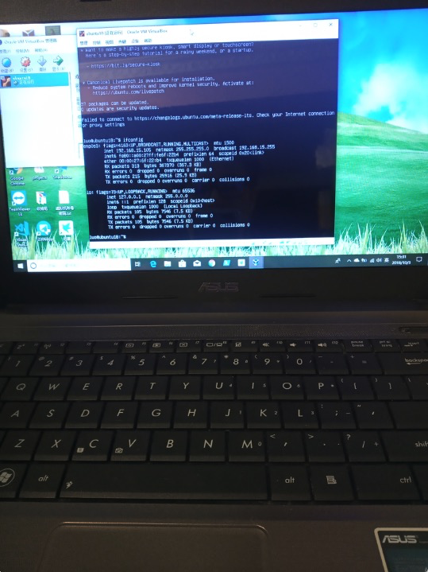

这台笔记本是我读大学用的『战机』，被我花巨资改造了一下：内存加到了 8G，换上一个 128G 的固态硬盘。这个笔记本在我读大学的时候已经被折腾过好多次了，自从毕业后就很少用了，所以拿出来在家里当服务器用，装了 win10 、 VirtualBox，然后装了一个 Ubuntu18.04.1 的虚拟机，分了 4G 内存、 40G 硬盘，安装好 docker、 docker-compose。

* 一台低配版 Mac mini。 8G 内存、 1T 硬盘，用终端连接 Ubuntu 服务器。题外话：直接在我的 Mac mini 上搭建 gitlab，发现有点带不起来，可能是因为我装了太多软件了。

硬件就这两台电脑，云服务器目前是买不起的，也没有必要。下面开始折腾吧。

## 先让 gitlab 跑起来

在 Ubuntu 服务器上拉取 gitlab-ce 官方镜像：

```powershell
docker pull gitlab/gitlab-ce:11.3.1-ce.0
```

> 注意：我使用的 tag 是 `11.3.1-ce.0` 

新建一个 `docker-compose.yml` 文件，写入如下内容：

```yaml
version: "3"

services:
  web:
    image: 'gitlab/gitlab-ce:11.3.1-ce.0'
    container_name: gitlab
    environment:
      GITLAB_OMNIBUS_CONFIG: |
        external_url 'http://git.blackmatch.cn'
    ports:
      - '80:80'
      - '443:443'
      - '33:22'
    volumes:
      - './srv/gitlab/config:/etc/gitlab'
      - './srv/gitlab/logs:/var/log/gitlab'
      - './srv/gitlab/data:/var/opt/gitlab'
```

保存文件，在该文件目录下执行：

```powershell
docker-compose up
```

然后会看到终端上刷刷刷 ~~~ 滚动很多内容，耐心等待一会（我这里大概 3 分钟左右），然后在我的 Mac mini 的浏览器上访问 `http://git.blackmatch.cn` （我事先已经将域名和 Ubuntu 服务器的 IP 做了 hosts 映射），看到如下界面：

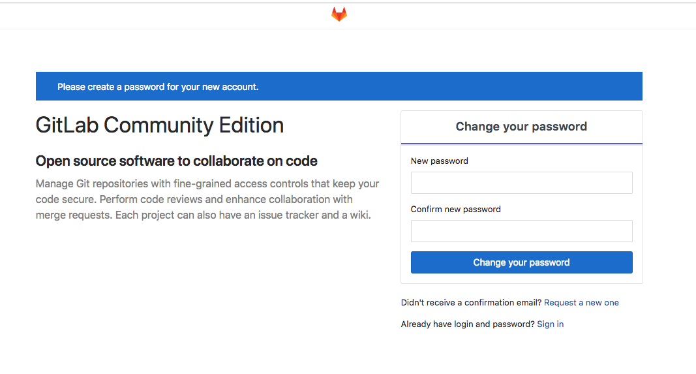

看到这个界面说明 gitlab 已经成功跑起来了，可以在这个界面设置 `root` 账号的密码，然后使用 `root` 账号登录系统：

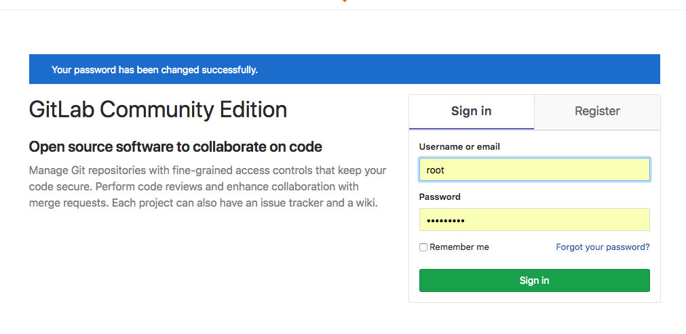

登录成功后的界面是这样的：

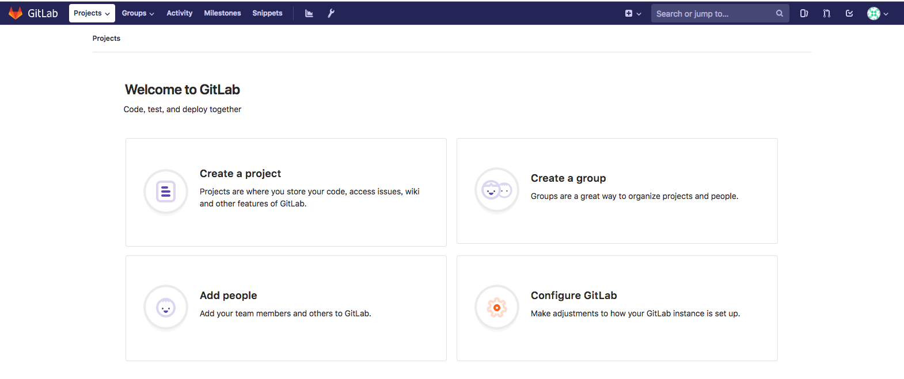

我来创建一个项目看看：

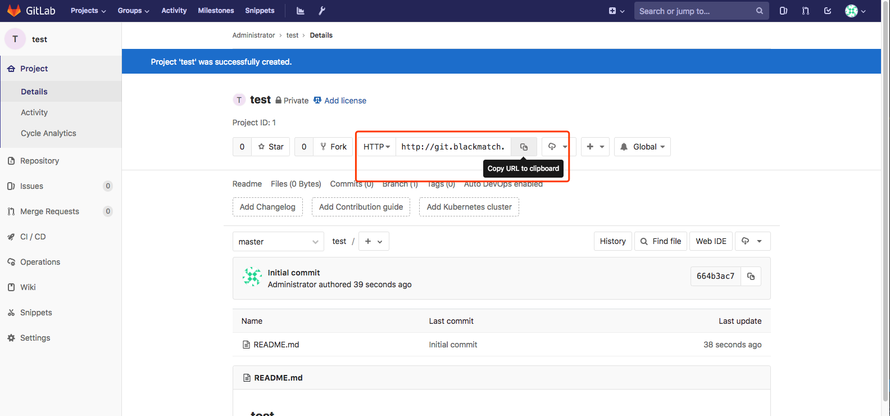

这个新建项目的 `HTTP` 地址为：[http://git.blackmatch.cn/root/test.git](http://git.blackmatch.cn/root/test.git)，这里顺带提一下，这里的地址中的 `git.blackmatch.cn` 就是我在 `docker-compose.yml` 文件中配置的环境变量：

```yaml
environment:
      GITLAB_OMNIBUS_CONFIG: |
        external_url 'http://git.blackmatch.cn'

```

这里的 `external_url` 配置的是外部 URL，会影响项目的访问地址，如果不配置，项目的访问地址会是一个随机字符串，在云服务器上搭建时尤其要注意这一点。

## 开启邮件服务

我们在使用 `github` 等类似的平台工具的时候都会用到邮件服务，比如你在 `github` 上进行注册、密码重置、有人给你的开源项目提 issue 等等的时候，你通常都会收到邮件提醒。 `gitlab` 肯定也会有这个功能的，下面我们就来开启这个功能，在此之前需要准备一个邮箱账号，这个账号是用来负责发送邮件的，需要开启 `smtp` 协议支持。使用 `CTRL` + `C` 快捷键停止正在运行中的 gitlab 容器，然后修改 `docker-compose.yml` 为如下内容（这里以 gmail 邮箱为例）：

```yaml
version: "3"

services:
  web:
    image: 'gitlab/gitlab-ce:11.3.1-ce.0'
    container_name: gitlab
    environment:
      GITLAB_OMNIBUS_CONFIG: |
        external_url 'http://git.blackmatch.cn'
        # email setting
        gitlab_rails['smtp_enable'] = true
        gitlab_rails['smtp_address'] = "smtp.gmail.com"
        gitlab_rails['smtp_port'] = 587
        gitlab_rails['smtp_user_name'] = "my.email@gmail.com"
        gitlab_rails['smtp_password'] = "my-gmail-password"
        gitlab_rails['smtp_domain'] = "smtp.gmail.com"
        gitlab_rails['smtp_authentication'] = "login"
        gitlab_rails['smtp_enable_starttls_auto'] = true
        gitlab_rails['smtp_tls'] = false
        gitlab_rails['smtp_openssl_verify_mode'] = 'peer'
    ports:
      - '80:80'
      - '443:443'
      - '33:22'
    volumes:
      - './srv/gitlab/config:/etc/gitlab'
      - './srv/gitlab/logs:/var/log/gitlab'
      - './srv/gitlab/data:/var/opt/gitlab'

```

将配置中的 `my.email@gmail.com` 和 `my-gmail-password` 替换为你自己的邮箱和密码，记得一定要开启邮箱的 `smtp` 协议服务，否则无法发送邮件。其他邮箱的配置方式大同小异，详细的介绍可以看这里：[https://docs.gitlab.com/omnibus/settings/smtp.html](https://docs.gitlab.com/omnibus/settings/smtp.html)。保存配置文件，然后执行 `docker-compose up` ，然后使用 `root` 账号登录 gitlab，新建一个账户（注意正确填写新建账户的邮箱地址），新建账户成功后，会给新账户的邮箱发送一封邮件，如下：

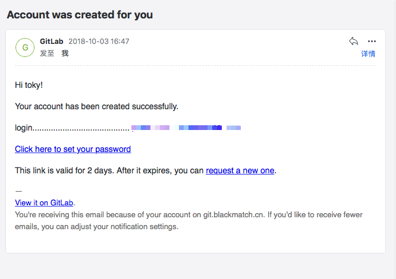

至此，邮件服务已成功启用。

## 安装 git-runner

前面我提到， gitlab 支持 CI/CD，如果我们需要对某个项目进行持续集成 / 持续交付，则需要给该项目配置一些任务，当我们每次 push 代码的时候，自动触发这些预先配置好的任务，而这些任务的执行者就是 gitlab-runner。可以简单的概括一下 gitlab 和 gitlab-runner 的关系： gitlab 在监测到有代码提交时，通知 gitlab-runner 去执行一些任务， gitlab-runner 执行完这些任务后将执行的结果反馈给 gitlab。所以，如果要开启 CI/CD，需要先完成两件事： 1. 在服务器上安装好 gitlab-runner； 2. 注册 gitlab-runner，打通 gitlab 和 gitlab-runner 之间的交互。在服务器上安装 gitlab-runner 的步骤如下：

* 下载二进制安装包

```powershell
sudo wget -O /usr/local/bin/gitlab-runner https://gitlab-runner-downloads.s3.amazonaws.com/latest/binaries/gitlab-runner-linux-amd64
```

* 修改权限：

```powershell
sudo chmod +x /usr/local/bin/gitlab-runner
```

* 在服务器上新增一个用户（ gitlab-runner），专门用于执行 CI/CD 任务：

```powershell
sudo useradd --comment 'GitLab Runner' --create-home gitlab-runner --shell /bin/bash
```

* 执行安装：

```powershell
sudo gitlab-runner install --user=gitlab-runner --working-directory=/home/gitlab-runner
```

* 启动 gitlab-runner：

```powershell
sudo gitlab-runner start
```

接下来就是注册 gitlab-runner，只有注册之后 gitlab 和 gitlab-runner 之间才能交互。使用 `root` 账号登录 gitlab 之后，在路由 `/admin/runners` 下可以看到注册 gitlab-runner 需要用到的 `URL` 和 `token` 。如下：

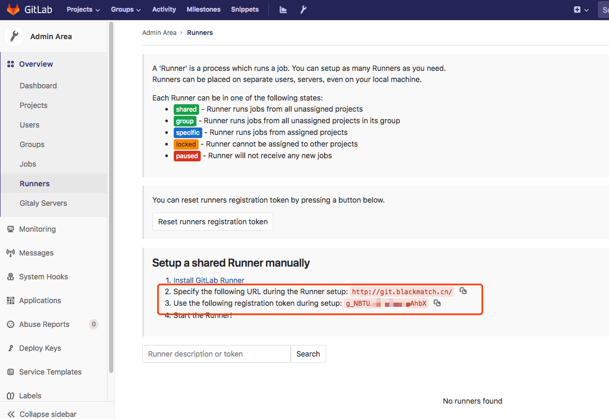

在服务器上执行：

```powershell
sudo gitlab-runner register
```

然后根据提示输入 `URL` 和 `token` 等信息就可以了，过程如下：

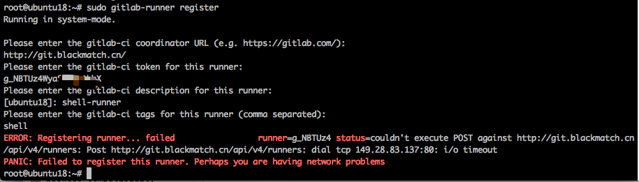

好吧。。。报错了，这个可能是我的 `URL` 是域名，但是服务器没有配置 `hosts` ，故在服务器上无法通过域名访问 gitlab，修改一下服务器的 `/etc/hosts` 文件，重新注册一下：

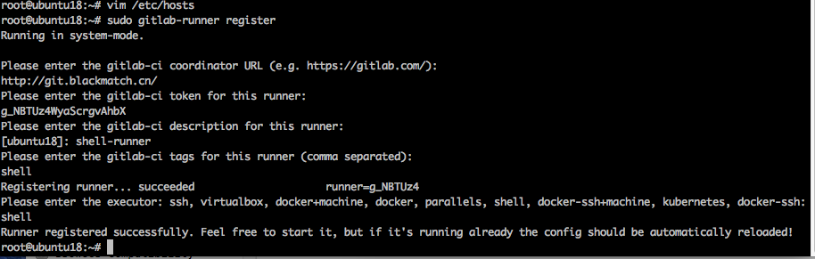

这回注册成功了，需要注意的是，在注册 gitlab-runner 的时候，需要选择一个或者多个执行器（ executor），不同的执行器有不同的特性和功能，如果你不知道怎么选择，可以先看看这里：[https://docs.gitlab.com/runner/executors/README.html#i-am-not-sure](https://docs.gitlab.com/runner/executors/README.html#i-am-not-sure)。我这里选择了最简单的 `shell` 执行器，`shell` 执行器可以让 gitlab-runner 在执行任务的时候直接使用 shell 命令，但是如果用到一些构建工具，必须事先在服务器上安装这些工具，例如：在代码提交后通知 gitlab-runner 执行 `npm run build` 命令来构建项目，则需要事先在服务器上安装 `npm` 。 gitlab-runner 注册成功后，刷新一下网页，会看到多了一个 runner：

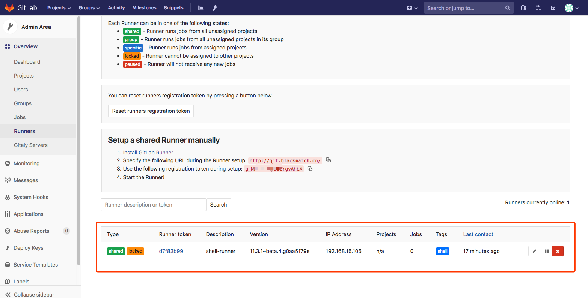

这样我们就可以使用这个 runner 为我们执行任务了，这里需要注意的是，新创建的 runner，默认情况下，只对打 `tag` 的 `commit` 触发任务，如果想要每一次提交代码都执行，则需要修改 runner 的配置，如下：

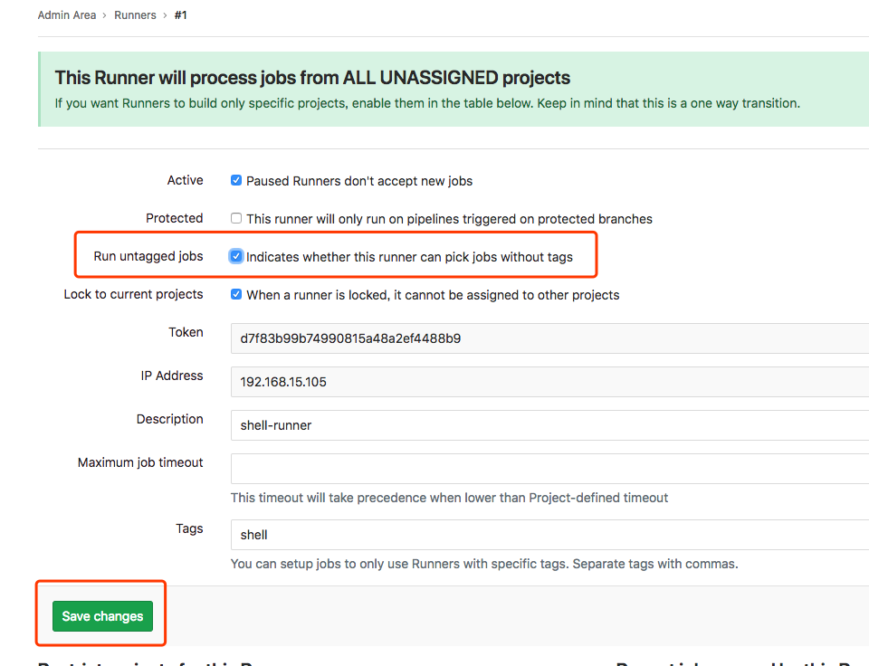

至此， gitlab-runner 就已开启成功了，可以对项目进行 CI/CD 配置了。

## 测试 CI/CD

经过前面的部署，目前我搭建的 gitlab 已经可以使用 CI 功能了，这里我简单的测试一下这个功能，前面我们已经使用 `root` 用户创建了一个 `test` 项目，将这个项目 `clone` 到我的 Mac mini 电脑上，然后在项目根目录下分别创建 `app.js` 和 `.gitlab-ci.yml` 这两个文件，要启用 gitlab 的 CI 功能，除了需要正配安装并配置好 gitlab-runner 外，还需要在每个项目的根目录下创建一个名为 `.gitlab-ci.yml` 文件，并在这个文件下配置具体的任务，例如我们可以简单的测试一下 gitlab-runner 是否能正常运行， `.gitlab-ci.yml` 文件内容如下：

```yaml
release:
  script:
    - cp ./app.js /home/gitlab-runner/release
```

这里就设置一个很简单的任务：将项目中的 `app.js` 文件拷贝到服务器的 `/home/gitlab-runner/release` 目录下。在我的 Mac mini 上对 `test` 项目修改的内容提交到服务器，会触发 gitlab-runner 执行任务，结果如下：

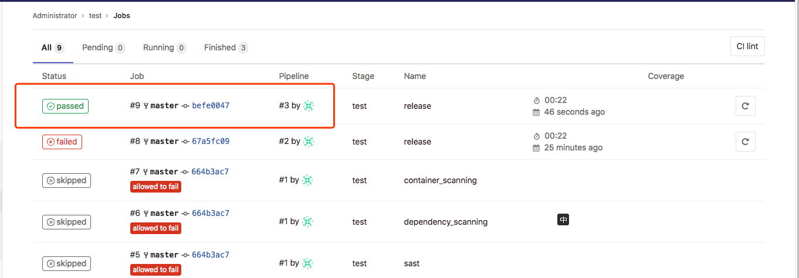

需要注意的是， gitlab-runner 在服务器上执行每个项目预先配置的任务的时候是以 `gitlab-runner` 用户的身份执行，所以要注意权限的问题，我第一次提交的时候，因为 `release` 目录是我用服务器的 `root` 权限创建的，所以 `gitlab-runner` 用户没有权限将文件复制到该目录下，修改目录所有者后，第二次提交就成功了，如下：

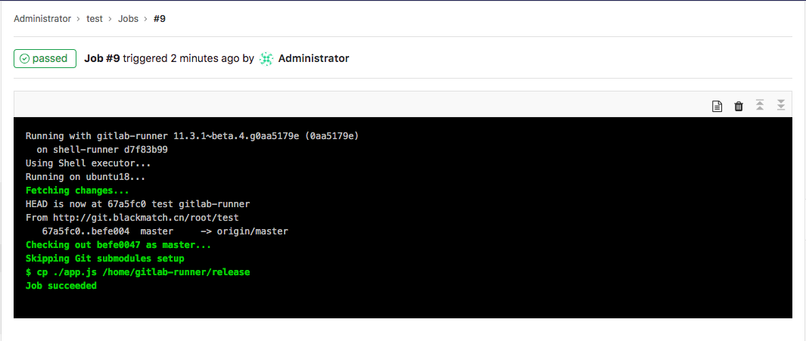

至此， gitlab-runner 执行 CI 任务就测试成功了。当然这只是一个很简单的测试， gitlab 还有很多关于 CI/CD、 Auto DevOps 等方面的功能特性，对持续集成、持续交付、提升项目质量等方面都有很大的帮助，大家感兴趣可以多去尝试。

## 完整的配置

经过上面的配置和调试，目前的 gitlab 已经能满足开发工作流中一些常用的需求，如果没有其他需求，可以直接把该容器投入到生产中，完整的 `docker-compose.yml` 文件内容如下：

```yaml
version: "3"

services:
  web:
    image: 'gitlab/gitlab-ce:11.3.1-ce.0'
    container_name: gitlab
    restart: always
    environment:
      GITLAB_OMNIBUS_CONFIG: |
        external_url 'http://git.blackmatch.cn'
        # email setting
        gitlab_rails['smtp_enable'] = true
        gitlab_rails['smtp_address'] = "smtp.gmail.com"
        gitlab_rails['smtp_port'] = 587
        gitlab_rails['smtp_user_name'] = "my.email@gmail.com"
        gitlab_rails['smtp_password'] = "my-gmail-password"
        gitlab_rails['smtp_domain'] = "smtp.gmail.com"
        gitlab_rails['smtp_authentication'] = "login"
        gitlab_rails['smtp_enable_starttls_auto'] = true
        gitlab_rails['smtp_tls'] = false
        gitlab_rails['smtp_openssl_verify_mode'] = 'peer'
    ports:
      - '80:80'
      - '443:443'
      - '33:22'
    volumes:
      - './srv/gitlab/config:/etc/gitlab'
      - './srv/gitlab/logs:/var/log/gitlab'
      - './srv/gitlab/data:/var/opt/gitlab'


```

保存文件后，使用如下命令启动容器：

```powershell
docker-compose up -d
```

至此， gitlab 已成功部署。

## 其他需要注意的问题

* gitlab 对服务器的性能要求较高，至少要保证有 4G 的内存，否则很容易出现各种奇怪的问题，比如网页 502 等。
* gitlab-runner 在执行任务的时候不对你的项目做任何修改，因为其原理是：先把项目所有内容 `fetch` （默认）或者 `clone` 到 `/home/gitlab-runner` 目录下，然后再执行相关的任务操作，不会对你的项目做任何修改。
* 每次修改完 `docker-compose.yml` 文件后，重新启动容器可能会花费较多的时间，请耐心等待。
* 汉化问题，可能较老的 gitlab-ce 版本需要专门下载一个中文包来做汉化，现在只需要在账户登录后，在账户设置中将 `Preferred language` 设置成 `简体中文` 即可，保存设置后刷新界面，效果如下：

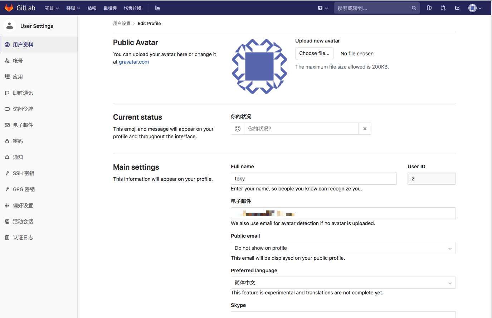

## 参考资料

[https://docs.gitlab.com/omnibus/docker/#install-gitlab-using-docker-compose](https://docs.gitlab.com/omnibus/docker/#install-gitlab-using-docker-compose)

[https://docs.gitlab.com/runner/](https://docs.gitlab.com/runner/)

[https://www.jianshu.com/p/2b43151fb92e](https://www.jianshu.com/p/2b43151fb92e)

[https://docs.gitlab.com/omnibus/settings/smtp.html](https://docs.gitlab.com/omnibus/settings/smtp.html)

[https://docs.gitlab.com/runner/executors/README.html](https://docs.gitlab.com/runner/executors/README.html)
