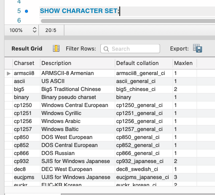
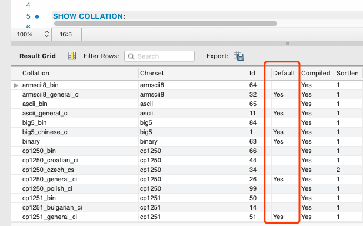
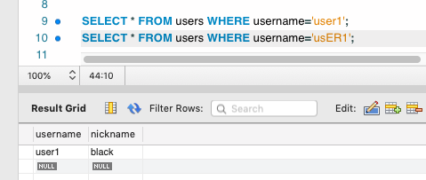
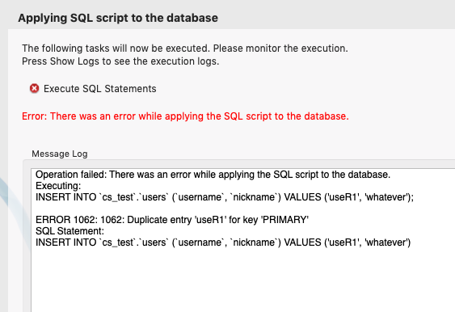
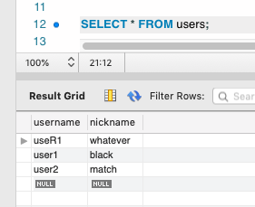
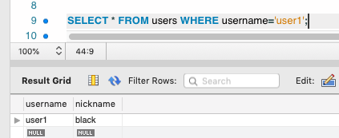
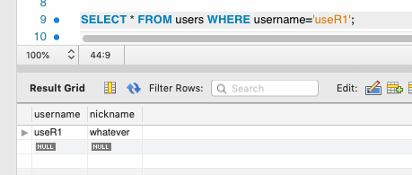
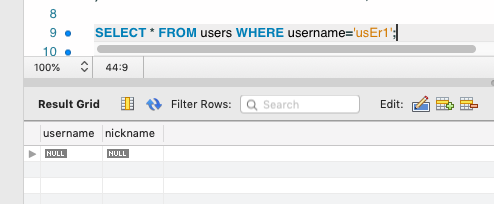

## 前言

MySQL 中的大小写敏感问题，可以从服务器 (Server)、数据库 (Database)、表 (Table)、字段 (Column) 这 4 个级别来配置， MySQL 的很多配置、操作等都是基于这 4 个级别的。**这4个级别的优先级为：字段>表>数据库>服务器**。而我们最关注的大小写敏感问题通常是对于数据而言的，举个简单的例子：字符串 `book` 和字符串 `Book` 存入到数据库后，我们通过 SQL 语句查询的时候，如果这两个字符串是相等的，那么说明 MySQL 比较这两个字符串的时候采用了 **大小写不敏感** 的方式，反之，则是使用了 **大小写敏感** 的方式。在讨论 MySQL 大小写敏感问题之前，我们需要先了解 MySQL 的两个概念：字符集 (CHARACTER SET) 和校对规则 (Collation)。

## 字符集 (CHARACTER SET) 和校对规则 (Collation)

字符集的通常解释是：符号和编码的集合。举个例子：假设我们有 4 个字母： A,B,a,b。我们给每个字母编个号码： A=0,B=1,a=3,b=4 。我们就可以说字母 A 是符号，编号 0 是它的编码。所有的字母和它们的编码组合起来就是我们通常说的字符集。如果我们想要比较两个字符串 A 和 B 的值的大小，那么我们很容就想到他们的编码， A 的编码是 0 ， B 的编码是 1 ，因为 **0小于1**，所以 **字符串 A 小于字符串 B**。我们做的这个比较就是给这个 **字符集(CHARACTER SET)** 应用了一套 **校对规则(Collation)**。

MySQL 拥有一套完整的字符集和校对规则。每一种字符集至少包含一种校对规则，且每种字符集都有默认的校对规则。

* 可以使用 `SHOW CHARACTER SET` 语句查看 MySQL 支持的字符集列表：



* 可以使用 `SHOW COLLATION` 语句查看 MySQL 支持的校对规则：



## 大小写敏感问题

接着上面的例子，如果我们想要大写字母 A 和小写字母 a 是相等的呢？那么我们需要做的就是将大写字母 A 和小写字母 a 的编码设置为一致的，然后比较它们的编码即可。这就是我们通常说的 **大小写不敏感校对规则**。反之，如果将大写字母 A 和小写字母 a 视为不相等的，就是我们通常说的 **大小写敏感校对规则**。

在不指定字符集和校对规则的情况下， MySQL 会使用默认的字符集 (utf8) 和校对规则 (utf8_general_ci)。校对规则的名称遵循规则：**以其相关的字符集开头，后加上一个或者多个后缀用于区分不同的校对规则**。相关后缀说明：

| 后缀 | 含义 |
|---|---|
|_ai| 口音不敏感 (Accent insensitive)|
|_as| 口音敏感 (Accent sensitive)|
|_ci| 大小写不敏感 (Case insensitive)|
|_cs| 大小写敏感 (case-sensitive)|
|_ks| 假名敏感 (Kana sensitive)|
|_bin| 二进制 (Binary，大小写敏感 )|

由此可以知道：**默认情况下，MySQL 所使用的校对规则是大小写不敏感的**。

## 设置大小写敏感

在日常的开发场景中，可能很少遇到需要设置大小写敏感的场景，而我恰巧遇到了。下面举例说明：

* 先创建一张用户表：

```sql
CREATE TABLE `users` (
  `username` varchar(32) NOT NULL,
  `nickname` varchar(32) DEFAULT NULL,
  PRIMARY KEY (`username`)
) ENGINE=InnoDB DEFAULT CHARSET=utf8;
```

> 这里我们先使用默认的字符集和校对规则。

* 插入两条数据：

```sql
INSERT INTO `cs_test`.`users` (`username`, `nickname`) VALUES ('user1', 'black');
INSERT INTO `cs_test`.`users` (`username`, `nickname`) VALUES ('user2', 'match');
```

* 查询数据：

```sql
SELECT * FROM users WHERE username='user1';
SELECT * FROM users WHERE username='usER1';
```

这两条 SQL 语句的查询结果是一致的：



* 现在我需要向`users`表中插入一条`username`为**useR1**的**另外一个用户**，发现报错了：

```sql
INSERT INTO `cs_test`.`users` (`username`, `nickname`) VALUES ('useR1', 'whatever');
```



理由很简单：因为 MySQL 此时使用的是大小写不敏感的校对规则，所以 `user1` 和 `useR1` 是相等的，而 `username` 是 `users` 表的 **主键**，所以在插入数据时会报主键冲突的错误。

* 设置`users`表的`username`字段使用**大小写敏感** 的校对规则：

```sql
ALTER TABLE `cs_test`.`users` 
CHANGE COLUMN `username` `username` VARCHAR(32) CHARACTER SET 'utf8' COLLATE 'utf8_bin' NOT NULL ;
```

然后再次尝试插入数据，这次插入成功了。此时 `users` 表中的数据如下：



* 再次查询用户表：







发现这次 `users` 表的 `username` 字段已经彻底变成了 **大小写敏感** 了。

## 总结

* 本文讨论的是 MySQL 数据校对规则的大小写敏感问题，而不是讨论表名的大小写敏感问题（网上很多文章都是讨论表名的大小写敏感问题）。
* 对 MySQL 的字符集和校对规则有一定的了解后有助于理解大小写敏感问题。
* MySQL 的 `utf8` 字符集并没有 `utf8_general_cs` 校对规则，网上有些文章存在误导。
* MySQL 的 `utf8_bin` 校对规则是大小写敏感的。
* MySQL 的 4 个级别优先级为：字段 (Column)> 表 (Table)> 数据库 (Database)> 服务器 (Server)，进行相关配置时尤其要注意。
* 最好不要对主键等其他含有索引的字段设置大小写敏感，容易导致索引失效，从业务角度考虑也不太合理。
