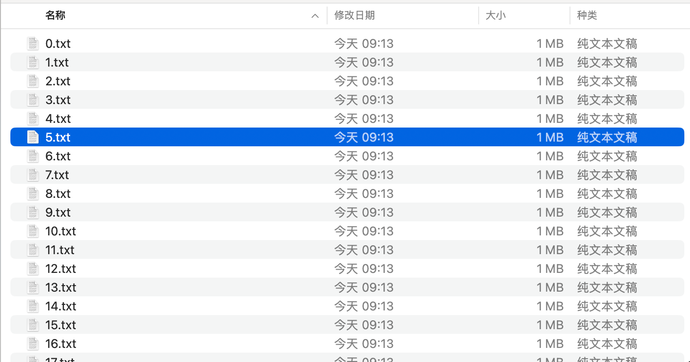
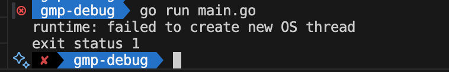
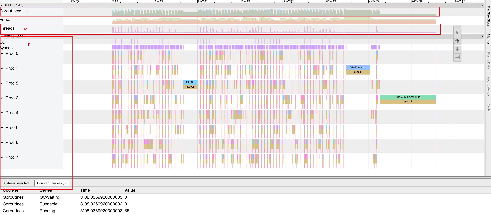
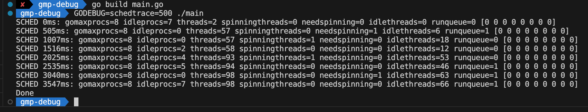
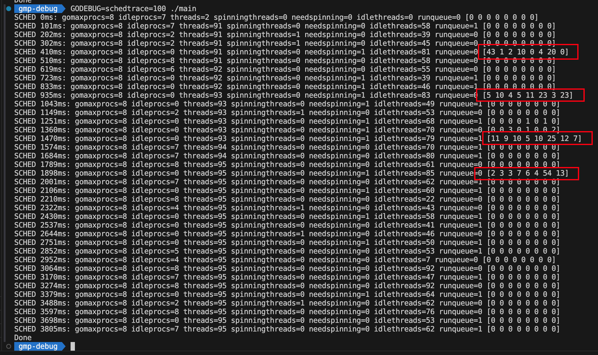
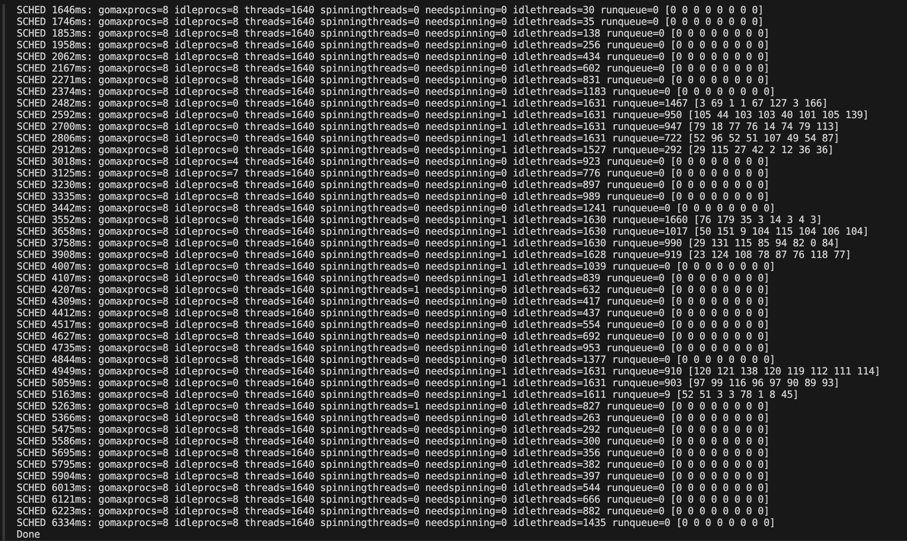

## 概述

学习 Go 的同学，肯定或多或少都对 Go 的 GMP 调度模型有所了解，网上也很多好的学习资料，这篇文章不会涉及太多 GMP 相关的理论知识。 GMP 模型能让 Go 程序尽可能压榨 CPU 的性能，从而提高并发处理能力。本文主要是从一个场景通过 debug 的方式去一窥 GMP 的工作方式，通过可视化的方式加深对 GMP 的理解。为了方便阅读先简单介绍一下 GMP：

* **G**：Goroutine ，Go 语言调度器中待执行的任务。
* **M**：Machine，操作系统线程，用来执行 **G** 的，调度器最多可以创建 10000 个线程，但最多只会有 `GOMAXPROCS` 个活跃线程能够正常运行。
* **P**：Processer，处理器，是 G 和 M 的中间层，它能提供线程需要的上下文环境，也会负责调度线程上的等待队列。

## 场景：开 10000 个 Goroutine 并发读取 10000 个文件

在没有开始学习 Go 语言之前，我就听说 Go 的协程很厉害，轻量级，开几万个协程都可以。然后我就想试一试开 10000 个 Goroutine 看看是什么情况：

* 先在本地创建 10000 个 txt 文件，每个文件的大小为 `1M`：



* 开 10000 个 Goroutine 并发读取：

```go
func main() {
  var wg sync.WaitGroup
  wg.Add(10000)
  for i := range 10000 {
    go func() {
    defer wg.Done()
    _, err := os.ReadFile(fmt.Sprintf("%d.txt", i))
    if err != nil {
      fmt.Println(err)
    }
    }()
  }
  wg.Wait()
  fmt.Println("done")
}
```

代码写好开始执行：



没想到竟然炸了，但好像又在意料之中。查了下这种情况是：操作系统对每个进程可以创建的线程数量有一定的限制。当 Go 程序尝试创建大量的 goroutine 时，每个 goroutine 最终可能需要一个操作系统线程来执行，一旦超过系统的线程数量限制，就会出现此错误。简而言之就是并发的 goroutine 太多了，我把并发量减少到 100，同时通过 `trace` 包记录下运行时的数据方便后续分析，完整的代码如下：

```go
func main() {
 f, err := os.Create("trace.out")
 if err != nil {
  panic(err)
 }
 defer f.Close()

 trace.Start(f)
 defer trace.Stop()

 batchSize := 100
 for start := 0; start < 10000; start += batchSize {
  var wg sync.WaitGroup
  end := start + batchSize
  if end > 10000 {
   end = 10000
  }
  for i := start; i < end; i++ {
   filename := fmt.Sprintf("%d.txt", i)
   wg.Add(1)
   go readFile(filename, &wg)
  }
  wg.Wait()
 }
 fmt.Println("Done")
}

func readFile(fileName string, wg *sync.WaitGroup) {
 defer wg.Done()
 _, err := os.ReadFile(fileName)
 if err != nil {
  fmt.Println(err)
 }
}
```

这次能成功运行了，会在当前目录下生成一个 `trace.out` 文件，我们执行：

```shell
go tool trace trace.out
```

然后根据提示打开浏览器就可以看到如下内容：



点击彩色部分可以在底下看到相关的信息，例如上图中是某一时刻 goroutine 的情况，可以看到当前 G0 处于 `GCWaiting` 状态，正在执行的 G 的 id 是 85，其他的暂时不展开了。通过 `trace` 包我们可以通过可视化的方式对 GMP 有了大概的感知，接下来我们继续分析 GMP 的调度。 我们把 `trace` 相关的代码去掉，把 G 的并发两加到 1000，然后通过 DEBUG 工具来分析：



```shell
GODEBUG=schedtrace=500 ./main
```

解释一下这个命令和输出的内容，这个命令是通过 debug 的方式启动 Go 程序，其中的 `schedtrace` 是指定 debug 的内容为调度器相关的数据，500 表示的是每隔 500 毫秒打印一次信息。关于输出的内容：

* `xxms` 表示程序启动到打印当前信息过去了多长时间。
* `gomaxprocs` 表示最多会有多少个 P 来处理 G，默认为CPU 的核心数，可以通过环境变量 `GOMAXPROCS` 和 `runtime.GOMAXPROCS()`这个函数来调整。
* `idleprocs` 表示处于空闲状态的 P 数量。
* `threads` 表示正在运行的线程数量。
* `spinningthreads` 表示处于自旋状态的线程的数量。在 Go 运行时的调度系统中，自旋是一种线程的状态，处于自旋状态的线程不会进入休眠，而是持续地检查是否有可执行的任务。
* `needspinning` 是一个用于判断是否需要启动新的自旋线程的条件。Go 运行时的调度器会根据当前系统的状态和任务负载来决定是否需要创建新的自旋线程。
* `idlethreads` 表示处于空闲状态的线程数量。
* `runqueue` 表示全局队列中正在等待被执行的 G 的数量。
* [0 0 0 0 0 0 0 0] 表示每个 P 的本地队列中等待被执行的 G 的数量。数组的长度为 `GOMAXPROCS` 。

从上图可以观察到一个比较奇怪的现象：为什么数组里的元素的值都是 0，也就是说每个 P 的本地队列都是空的。稍加思索后，我想到可能是因为我设置了每隔 500 毫秒才打印一次信息，可能程序执行太快，500 毫秒后所有的 G 都已经执行完成或者正在执行中，所以本地队列里都是空的。我调成 100 毫秒后结果如下：



从上图中可以看出：

* `idleprocs` 的值在不断变化，但最大不会超过 `gomaxprocs` 的值。
* `threads` 稳定在 90 多，说明同时有 90 多个线程在工作。
* 在全局队列几乎为 0 的情况下，各个 P 的本地队列数量之和是在逐步减少的，但是某个 P 的队列的数量会突然增多。

随后我又将 G 的并发调成 2000 进行调试，得到如下结果：



结合 GMP 的理论知识，我们可以得到以下结论：

* Go 会开启多线程去并发执行 goroutine，线程的数量会根据 goroutine 的数量进行调整。
* GMP 通过 **hand off 机制**，当正在执行的 G 发生阻塞时，会把 G 与当前的 P 断开，将 P 及其本地队列重新绑定到一个休眠的 M 上或者新建一个 M 来绑定。可以从调试的结果中看出在执行到后期 `idleprocs` 的值等于 `gomaxprocs` 的值了，这是因为 G 执行的都是阻塞任务（读取文件），每个 G 经过 P 的短暂处理后就会跟 P 断开，所以程序执行到后面会有很多空闲的 P，G 都已经进入系统调用状态，最后被放入全局队列后最终被执行完成。
* GMP 通过 **work stealing 机制**，当一个 P 的本地队列和全局队列都空了的时候，它就从其他 P 的队列中偷一些 G 过来放到自己的本地队列中。图中数组倒数第二个元素最后一个大于 0 的值为 54，这个值大于之前出现过的所有的值，就说明对应的 P 是从其他 P 的本地队列中偷了一部分 G 过来了。

综上，Go 的 GMP 模型使其能够最大限度地压榨 CPU 的性能，从而能够支撑更高的并发，提升程序的性能。

## 参考资料

* 刘丹冰 B 站视频
* https://draveness.me/golang/docs/part3-runtime/ch06-concurrency/golang-goroutine/#65-%E8%B0%83%E5%BA%A6%E5%99%A8