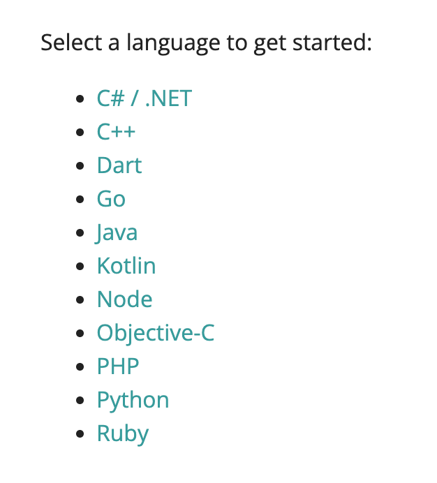
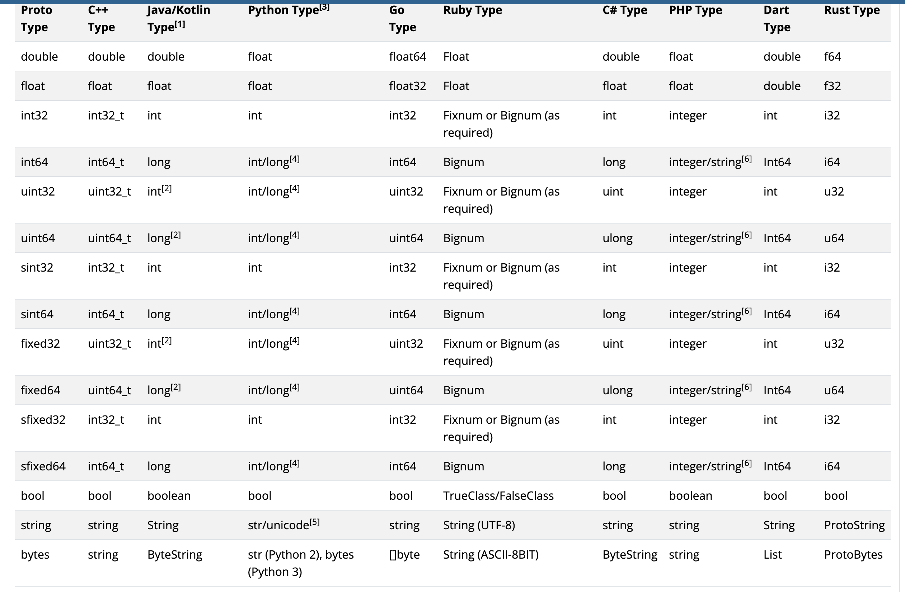

什么是 gRPC？

> A high performance, open source universal RPC framework.

`gRCP` 是一个高性能、开源的、通用的 RPC 框架：


从上图可以看出：

* gRPC 分为服务端（Server）和客户端（Stub/Client）两个部分
* 服务端和客户端之间通过 `Protocal Buffers` 协议进行通讯
* 服务端和客户端支持跨语言调用

gRPC 支持众多主流编程语言：



下面通过一个 Hello world demo 来逐步了解 gRPC。

## Protocal Buffers

> Protocol Buffers are a language-neutral, platform-neutral extensible mechanism for serializing structured data.

简单来说 [Protocal Buffers](https://protobuf.dev/overview/) 是一套用于序列化和反序列化数据的机制，与平台无关，与语言无关，gRPC 默认使用这套机制。举个例子 `./proto/greeter.proto`：

```proto
syntax = "proto3";
option go_package = "./greeter";

// The greeting service definition.
service Greeter {
  // Sends a greeting
  rpc SayHello (HelloRequest) returns (HelloReply) {}
}

// The request message containing the user's name.
message HelloRequest {
  string name = 1;
}

// The response message containing the greetings
message HelloReply {
  string message = 1;
}
```

* `syntax = "proto3";` 是固定写法，显式声明使用 Protocal Buffers 的 version 3 版本。
* `option go_package = "./greeter";` 是定义生成 Go 语言的配置，这里的配置会在当前目录下生成一个 `greeter` 目录，里面的报名也是 `greeter`。其他语言写法大同小异。
* `service` 是 Protocal Buffers 用来定义一个微服务的关键字，service 里面可以定义各种微服务需要提供的方法，最主要的就是要声明入参（这里是 `HelloRequest`）和出参（这里是 `HelloReply`）。
* `message` 是 Protocal Buffers 用来定义一个结构体的关键字，对应的 Go 语言的 `struct` 关键字。

Protocal Buffers 有自己的基本数据类型，并且能契合各种编程语言：



Protocal Buffers 使用 `.proto` 作为文件后缀，定义好相关内容后，就可以使用配套的工具生成对应编程语言所需要的代码文件，这里以 Go 语言为例，在 `./proto` 目录下执行：

```shell
protoc --go_out=./ *.proto
```

这个命令主要是根据 `message` 关键字定义的内容生成 Go 语言对应的结构体及一些相关的函数，会生成一个名为 `./proto/greeter/greeter.pb.go` 文件，这个文件可以直接在 Go 语言代码中引用，具体内容就不展开了。

```shell
protoc --go-grpc_out=./ *.proto
```

这个命令会生成 gRPC 所需的一些接口和方法，会生成一个名为 `./proto/greeter/greeter_grpc.pb.go` 文件，这个文件里包含很多内容，这里挑几个重要的解释一下：

```go
// The greeting service definition.
type GreeterClient interface {
	// Sends a greeting
	SayHello(ctx context.Context, in *HelloRequest, opts ...grpc.CallOption) (*HelloReply, error)
}
```

这个 interface 是根据 Protocal Buffer 中 `service` 关键字定义的内容来生成的，定义一个 gRPC 接口，包含相关的函数。

```go
func RegisterGreeterServer(s grpc.ServiceRegistrar, srv GreeterServer) {
	// If the following call pancis, it indicates UnimplementedGreeterServer was
	// embedded by pointer and is nil.  This will cause panics if an
	// unimplemented method is ever invoked, so we test this at initialization
	// time to prevent it from happening at runtime later due to I/O.
	if t, ok := srv.(interface{ testEmbeddedByValue() }); ok {
		t.testEmbeddedByValue()
	}
	s.RegisterService(&Greeter_ServiceDesc, srv)
}
```

这一段是用于 gRPC 服务端注册服务时使用的。

```go
func NewGreeterClient(cc grpc.ClientConnInterface) GreeterClient {
	return &greeterClient{cc}
}
```

这一段是用于 gRPC 客户端跟服务端建立连接时使用的。

通过 Protocal Buffers 配套工具生成的代码文件是服务端和客户端通用的，一份 `.proto` 文件可以生成多份不同编程语言的代码。上述生成 Go 语言代码的例子用到了 3 个工具：

```shell
brew install protobuf
brew install protoc-gen-go
brew install protoc-gen-go-grpc
```

* `protobuf` 是主程序，在命令行通过 `protoc` 使用。
* `protoc-gen-go` 对应 `--go_out` 参数，用于生成 `greeter.pb.go` 文件。
* `protoc-gen-go-grpc` 对应 `--go-grpc_out` 参数，用于生成 `greeter_grpc.pb.go` 文件。

## 服务端（Server）

服务端的构建分为以下几个步骤：

* 新建一个结构体，将 Protocal Buffers 中定义的服务的方法实现并绑定到这个结构体。
* 新建一个 gRPC 服务。
* 将上述新建的结构体注册到新建的 gRPC 服务中。
* 新建一个监听器，用于将 gRPC 服务暴露到某个端口。
* 启动 gRPC 服务。

完整的代码示例如下：

```go
type server struct {
	greeter.UnimplementedGreeterServer
}

func (s *server) SayHello(_ context.Context, in *greeter.HelloRequest) (*greeter.HelloReply, error) {
	return &greeter.HelloReply{Message: "Hello " + in.Name}, nil
}

func main() {
	grpcServer := grpc.NewServer()
	greeter.RegisterGreeterServer(grpcServer, &server{})

	listener, err := net.Listen("tcp", ":8080")
	if err != nil {
		log.Fatalf("failed to listen: %v", err)
	}
	defer listener.Close()

	if err := grpcServer.Serve(listener); err != nil {
		log.Fatalf("failed to serve: %v", err)
	}
}
```

## 客户端（Stub/Client）

客户端调用服务端分为以下几个步骤：

* 新建一个 gRPC 客户端连接。
* 使用这个 gRPC 连接新建一个 Protocal Buffers 生成的客户端。
* 使用新建的客户端直接调用服务端的方法。

完整的代码如下：

```go
func main() {
	clientConn, err := grpc.NewClient("localhost:8080", grpc.WithTransportCredentials(insecure.NewCredentials()))
	if err != nil {
		fmt.Println("Error connecting to server")
		return
	}
	greeterClient := greeter.NewGreeterClient(clientConn)
	res, err := greeterClient.SayHello(context.Background(), &greeter.HelloRequest{Name: "World"})
	if err != nil {
		fmt.Println("Error calling SayHello")
		return
	}
	fmt.Println(res.Message)
}
```

这里的 `grpc.WithTransportCredentials(insecure.NewCredentials())` 参数是指客户端不实用任何安全机制跟服务端通讯，是明文传输，这里是本地 demo 调试，不用在意。生产环境通常需要配置 TLS，使用 `credentials.NewTLS()`。

## 参考资料

* https://grpc.io/docs/what-is-grpc/introduction/
* https://protobuf.dev/programming-guides/proto3/